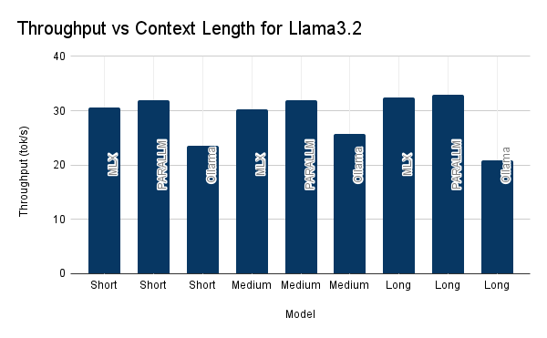
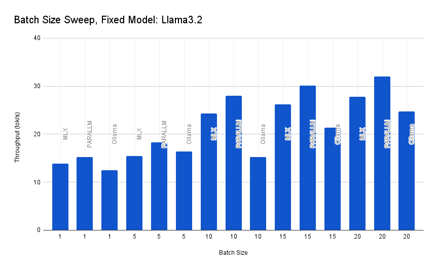

# PARALLM Client Benchmarking

## Overview

For this PR, I implemented the **MLX-PARALLM** client and evaluated its performance on Minion workloads with various context lengths and batch sizes. The experiments involved:

- **Context Lengths:**  
  Evaluated three client types (MLX, MLX-PARALLM, and OLlama) across three models:  
  - **Llama3.2 (Meta)**
  - **Gemma3 (Google)**
  - **Phi3.5 (Microsoft)**  
  Each was tested on:
  - **Short:** 5 sentences
  - **Medium:** 20 sentences
  - **Long:** 30 sentences

- **Batch Sizes:**  
  With Llama3.2 and a medium context, batch sizes of 1, 5, 10, 15, and 20 were swept. Here, **batch size** refers to the number of questions passed in a single message, with the context containing only the relevant information for those questions. The maximum output tokens were set to 1000 × batch_size.

To achieve optimal performance, I used the 8B parameter model versions and tuned kernel parameters on my M3 Mac. Note that MLX is still under active development, so the performance figures might vary with system memory state and ongoing improvements. The full data is shown [here](https://docs.google.com/spreadsheets/d/1IH-xpbUJR6-BNED3eiMSORoRWESVv9N49g63nhEIZoM/edit?usp=sharing).

## Context Length Comparisons

- **Latency vs. Context Length (Llama3.2 fixed):**  
  
  - Both MLX and PARALLM exhibit stable inference times as context length increases.
  - **PARALLM** consistently achieves slightly higher throughput compared to MLX. It also tends to generate more tokens on average compared to the other models we benchmarked again.
  - **OLlama** records longer inference times and lower throughput.

- **Latency vs. Model (Long context fixed):**  
  
  - For Llama3.2 and Gemma, MLX and PARALLM yield comparable performance with low inference times and high throughput.
  - The **Phi3.5** model is noticeably slower across all clients, suggesting its architecture induces higher latency.

## Batch Size Comparison

When testing batch sizes with Llama3.2:

- **PARALLM** consistently demonstrates the highest throughput (tokens per second) across all batch sizes.
- This aligns with expectations and the findings highlighted in the [PARALLM blog post](https://willcb.com/blog/parallm/).  
  *Note:* The measured throughput is lower than the 1600+ tok/s cited in the blog because our measurement captures the full latency for multiple minion back-and-forth rounds.

## Discussion

Compared to the MLX and OLlama baselines, the **PARALLM local client** excels, particularly with larger batch sizes, due to its batched key-value caching mechanism. The KV-caching mechanism reduces redundant computation across multiple decoding channels, reducing latency for parallel inference requests in minion workloads.
